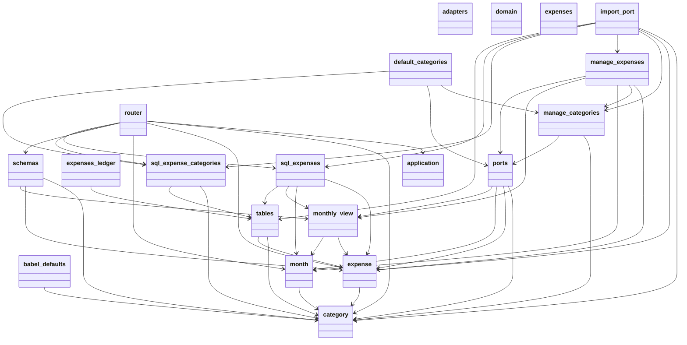
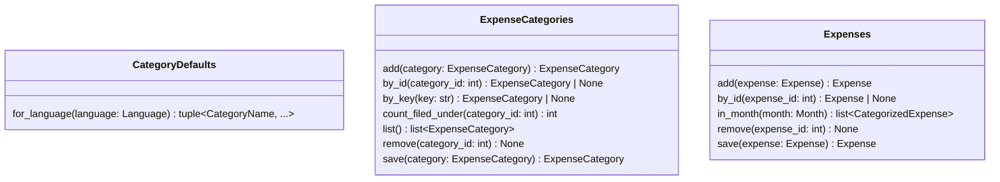

<!-- Generated by scripts/docs/generate.py. Do not edit; run `uv run --no-project python -m scripts.docs.generate` instead. -->

# expenses

## Packages

```mermaid
classDiagram
  class adapters {
  }
  class application {
  }
  class babel_defaults {
  }
  class category {
  }
  class default_categories {
  }
  class domain {
  }
  class expense {
  }
  class expenses {
  }
  class expenses_ledger {
  }
  class import_port {
  }
  class manage_categories {
  }
  class manage_expenses {
  }
  class month {
  }
  class monthly_view {
  }
  class ports {
  }
  class router {
  }
  class schemas {
  }
  class sql_expense_categories {
  }
  class sql_expenses {
  }
  class tables {
  }
  babel_defaults --> category
  default_categories --> manage_categories
  default_categories --> ports
  default_categories --> sql_expense_categories
  expense --> category
  expenses_ledger --> tables
  import_port --> category
  import_port --> expense
  import_port --> manage_categories
  import_port --> manage_expenses
  import_port --> sql_expense_categories
  import_port --> sql_expenses
  import_port --> tables
  manage_categories --> category
  manage_categories --> ports
  manage_expenses --> expense
  manage_expenses --> manage_categories
  manage_expenses --> month
  manage_expenses --> monthly_view
  manage_expenses --> ports
  month --> category
  monthly_view --> expense
  monthly_view --> month
  ports --> category
  ports --> expense
  ports --> month
  ports --> monthly_view
  router --> application
  router --> category
  router --> expense
  router --> month
  router --> schemas
  router --> sql_expense_categories
  router --> sql_expenses
  schemas --> category
  schemas --> expense
  schemas --> monthly_view
  sql_expense_categories --> category
  sql_expense_categories --> tables
  sql_expenses --> expense
  sql_expenses --> month
  sql_expenses --> monthly_view
  sql_expenses --> tables
  tables --> category
  tables --> expense
```

## domain

```mermaid
classDiagram
  class CategorizedExpense {
    category_name : str
    category_name_key : str
    expense
  }
  class CategoryInUse {
    code : ClassVar~str~
  }
  class CategoryName {
    key : str
    value : str
    of(raw: str) CategoryName
  }
  class CategoryNameTaken {
    code : ClassVar~str~
  }
  class CategoryNotFound {
    code : ClassVar~str~
  }
  class CategorySubtotal {
    category_id : int
    expenses : tuple~Expense, ...~
    name : str
    subtotal : int
  }
  class Expense {
    amount : int
    category_id : int
    detail : str
    id : int #124; None
    recorded_at : datetime
    spent_on : date
    of(spent_on: date, category_id: int, amount: int, detail: str, today: date, recorded_at: datetime, id: int #124; None) Expense
  }
  class ExpenseCategory {
    id : int #124; None
    name
    check_removable(filed_expenses: int) None
    rename(name: CategoryName) None
  }
  class ExpenseNotFound {
    code : ClassVar~str~
  }
  class ExpenseRuleBroken {
    code : ClassVar~str~
  }
  class InvalidAmount {
    code : ClassVar~str~
  }
  class InvalidCategoryName {
    code : ClassVar~str~
  }
  class InvalidDetail {
    code : ClassVar~str~
  }
  class InvalidExpenseDate {
    code : ClassVar~str~
  }
  class InvalidMonth {
    code : ClassVar~str~
  }
  class Month {
    containing(day: date) Month
    of(raw: str) Month
  }
  class MonthlyExpenses {
    categories : tuple~CategorySubtotal, ...~
    month
    total : int
    of(month: Month, categorized: Sequence~CategorizedExpense~) MonthlyExpenses
  }
  CategorizedExpense --> Expense : expense
  ExpenseCategory --> CategoryName : name
  InvalidAmount --|> ExpenseRuleBroken
  InvalidCategoryName --|> ExpenseRuleBroken
  InvalidDetail --|> ExpenseRuleBroken
  InvalidExpenseDate --|> ExpenseRuleBroken
  InvalidMonth --|> ExpenseRuleBroken
  MonthlyExpenses --> Month : month
```

## application

```mermaid
classDiagram
  class CategoryDefaults {
    for_language(language: Language) tuple~CategoryName, ...~
  }
  class ExpenseCategories {
    add(category: ExpenseCategory) ExpenseCategory
    by_id(category_id: int) ExpenseCategory #124; None
    by_key(key: str) ExpenseCategory #124; None
    count_filed_under(category_id: int) int
    list() list~ExpenseCategory~
    remove(category_id: int) None
    save(category: ExpenseCategory) ExpenseCategory
  }
  class Expenses {
    add(expense: Expense) Expense
    by_id(expense_id: int) Expense #124; None
    in_month(month: Month) list~CategorizedExpense~
    remove(expense_id: int) None
    save(expense: Expense) Expense
  }
```

## adapters

```mermaid
classDiagram
  class BabelCategoryDefaults {
    for_language(language: Language) tuple~CategoryName, ...~
  }
  class CategoryIn {
    name : str
  }
  class CategoryOut {
    id : int
    name : str
    of(category: ExpenseCategory) 'CategoryOut'
  }
  class CategorySubtotalOut {
    expenses : list~ExpenseOut~
    id : int
    name : str
    subtotal : int
  }
  class ExpenseCategoriesOpening {
    opened(business_id: int, language: BusinessLanguage) None
  }
  class ExpenseCategoryRow {
    business_id : Mapped~int~
    id : Mapped~int~
    name : Mapped~str~
    name_key : Mapped~str~
  }
  class ExpenseIn {
    amount : int
    category_id : int
    detail : str
    spent_on : date
  }
  class ExpenseOut {
    amount : int
    category_id : int
    detail : str
    id : int
    spent_on : date
    of(expense: Expense) 'ExpenseOut'
  }
  class ExpenseRow {
    amount : Mapped~int~
    business_id : Mapped~int~
    category_id : Mapped~int~
    detail : Mapped~str~
    id : Mapped~int~
    recorded_at : Mapped~datetime~
    spent_on : Mapped~date~
  }
  class ExpensesImport {
    category_key(raw: str) str #124; Refusal
    check_expense(row: GastoRow, today: date) Refusal #124; None
    has_records() bool
    write_category(name: str, transaction: Transaction) int
    write_expense(category_id: int, row: GastoRow, recorded_at: datetime, today: date, transaction: Transaction) None
  }
  class MonthlyViewOut {
    categories : list~CategorySubtotalOut~
    month : str
    total : int
    of(view: MonthlyExpenses) 'MonthlyViewOut'
  }
  class SqlExpenseCategories {
    add(category: ExpenseCategory) ExpenseCategory
    by_id(category_id: int) ExpenseCategory #124; None
    by_key(key: str) ExpenseCategory #124; None
    count_filed_under(category_id: int) int
    list() list~ExpenseCategory~
    remove(category_id: int) None
    save(category: ExpenseCategory) ExpenseCategory
  }
  class SqlExpenses {
    add(expense: Expense) Expense
    by_id(expense_id: int) Expense #124; None
    in_month(month: Month) list~CategorizedExpense~
    remove(expense_id: int) None
    save(expense: Expense) Expense
  }
  class SqlExpensesLedger {
    all() list~ExpenseRecord~
  }
```
